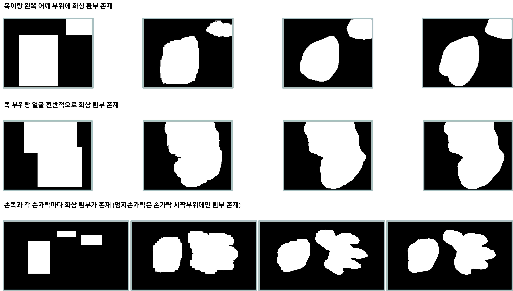

# Burn Segmentation — 화상 진단 보조 세그멘테이션 모델

> 화상(열상) 심도 분석 보조를 위한 Segmentation 모델 개발
> 기간: 2023.08 – 2023.12 | Repo: github.com/fly4hyun/burn-segmentation

---

## Summary

* **민감정보 보호**를 위해 환부 원본 이미지는 사용하지 않고 **마스크 결과만 취급**
* **Active Learning + SAM**으로 Bounding Box → Segmentation 데이터 자동/반자동 생성 파이프라인 구축
* 2,000여 장의 박스 데이터에서 출발하여 임상적 활용도를 높인 **세그멘테이션 데이터셋** 제작 및 모델 학습

---

## Approach

1. **초기 데이터**: 약 2,000장 **Bounding Box** 주석
2. **SAM 초기학습(Pre-training된 가중치 사용)**: Box Prompt로 **중간 수준(박스와 Seg 중간) 마스크** 생성
3. **능동 학습(Active Learning) 루프**:

   * 5–10 Epoch 학습 후 **모델 예측 마스크**와 **기존 박스**를 비교
   * 세그멘테이션에 더 근접한 결과를 **자동/반자동 선별**하여 정답 마스크로 반영
   * 선별·보정된 마스크로 **재학습** → 반복
4. **최종 단계**: 정제된 Segmentation 데이터셋으로 **SAM 파인튜닝**

---

## Pipeline

* **Data Source**: Bounding Box 주석 → 마스크 후보 생성(SAM) → 선별/보정 → 재학습 반복
* **Model**: SAM 기반 Segmentation (Box Prompt → Mask)
* **Training**: Epoch 단위 평가·선별·보정 루프(Active Learning)
* **Output**: 환부 **마스크(Polygon/RLE)** 및 지표(DSC/IoU)

---

## My Contribution

* **Bounding Box→Seg 데이터 전환 파이프라인** 설계/구현(Active Learning 루프)
* **SAM 학습·추론 스크립트** 및 보정/선별 로직 개발
* 품질관리 지표(DSC/IoU)와 샘플 기반 **선별 임계치** 설계
* 민감정보 비식별화 정책 수립(원본 미보관, 마스크만 관리)

---

## 결과 요약

* 박스만 있는 초기 데이터에서 시작하여 **세그멘테이션 학습 가능한 데이터셋**으로 전환 성공
* 임상 보조용 시각화(마스크 오버레이) 및 지표 기반 점검 루틴 확립

---

## Screenshots

### 1) Active Learning 단계별 마스크 예시

  

### 2) 공개 저작권 이미지

  

---

## Notes on Disclosure

* 환자/임상 원본 이미지는 **보관·공개하지 않음** (마스크 결과만 관리)
* 일부 데이터 출처 및 내부 지표는 비공개이며, 구조·방법론 수준의 설명만 제공합니다.
